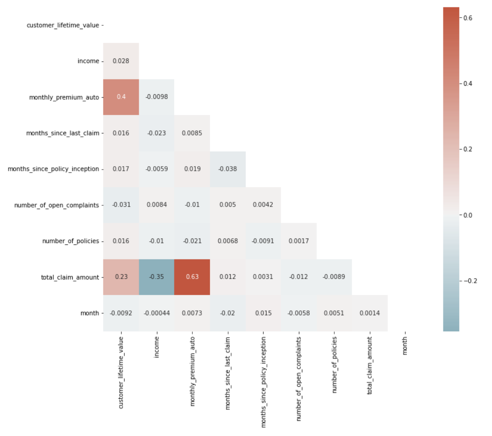

# Using linear regression to predict the insurance claim amount :oncoming_automobile: :blue_car: :truck: :moneybag:

## The situation
### Scenario:
We are risk analysts employed at an insurance company. Our team is focusing on the claims our clients make. We are given data from roughly 11.000 of our customers.

### Challenge:
Given a data set, building a machine learning model to find out what features determine the amount claimed by a certain customer, and to what degree.

## The analysis process
The complete analysis is available [here](final_code/customer_analysis_prediction.ipynb).

## Tools used
* Github
* EDA: assessment of dataframe to prepare for cleaning
* Data cleaning & wrangling in Python: drop 'customer_number' column, drop null values, convert float columns to int
  * Prepocessing: 3 methods - Normalizer, Dummies and SMOTE
* Scikit learn for Machine Learning modeling
  * Iteration 1 (X): This model has had removed its outliers, as well as the columns 'customer' and 'effective_to_date'. Also, a Normalizer scaler has been applied to the numerical features, and the categorical ones have been encoded using OHE. This model has also served as a benchmark for the subsequent ones
  * Iteration 2 (X_2): The same as the first one, except it includes the outliers
  * Iteration 3 (X_3): This candidate model has kept the outliers removed, since their inclusion did not increase the model's precision, and has had the columns 'number_of_policies', 'number_of_open_complaints', 'months_since_policy_inception' and 'months_since_last_claim' removed. This last decision is based on the heatmap below: all of these variables barely correlate with out label, and thus might introduce noise in the model

## Key take aways
- The best performing model, based on their indicators, is actually the base model (Model (X)), with an explained variance of roughly 77% and a mean average error (MAE) of 87.7. Therefore, this model allows us to predict the total claimed amount of a certain customer (as long as its features are similar to the ones in our sample) within a margin of 87.7$.

- Other insights, albeit not very promising, are that a lot of relevant data is missing, and most of the available one barely correlates with the set label.
