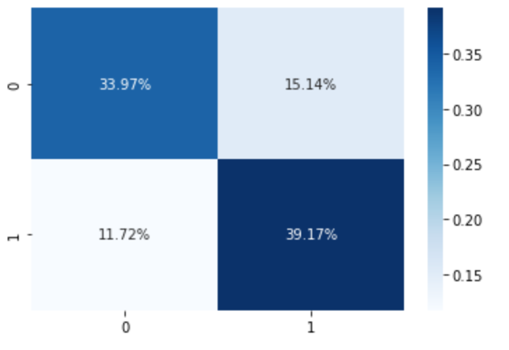

# Using logistic regression to predict customer churn for a telecom company :telephone: :walking: :arrows_counterclockwise:

## The situation
### Scenario:
We are data analysts employed at a telecom company. Marketing team wants to know which clients will stay and which will leave, a concept otherwise known as customer churn. We are given data from roughly 7.000 of our customers.

### Challenge:
Given a data set, building a machine learning model to predict if a customer will churn or not. It's a binary classification task, with the added difficulty that data is unbalanced. Marketing team is especially interested in predicting the minority class, which are the customers that will indeed churn.

## The analysis process
The complete analysis is available [here](final_code/customer_churn.ipynb).

## Tools used
* Github

* EDA: assessment of dataframe to prepare for cleaning.

* Python:

   * **Data cleaning & wrangling:** standardizing the column names to lowercase and extracting the label from the features. No nulls or duplicates were found in the dataset.

   * **Prepocessing:**
First, features were scaled. This was achieved via a Normalizer scaler to standardize the features' magnitudes and ranges. The distribution of our features was such before the scaling:

And such after the scaling process:

Then, resampling techniques were applied to deal with the original data imbalance. More on that in the following section.

* Scikit learn for Machine Learning modeling

  * **Iteration 1 (X):** This model uses Logistic regression and has had a Normalizer scaler applied to its features, but no resampling techniques. Thus, it is considered the base model and the benchmark for the subsequent ones. It got an accuracy score of 0.76 and the following confusion matrix:

  * **Iteration 2 (X_smote):** For this iteration, the SMOTE resampling technique was applied. Surprisingly, the model got an accuracy score of 0.73 and the following confusion matrix:

  * **Iteration 3 (X_tl):** This iteration of the model uses the Tomek Links resampling technique insted. The model also didn't beat the baseline one, with an accuracy score of 0.75 and this confusion matrix:

  * **Iteration 4 (X_smtl):** The final iteration of the baseline model combined both resampling techniques. First, SMOTE was applied, and then Tomek Links was used as a sort of a data cleaner. The model didn't beat the baseline one with an accuracy score of 0.74 and a confusion matrix as such:

## Key take aways
- The best performing model, based on accuracy alone, is actually the base model (Iteration (X)), with an accuracy score of roughly 76%.
- Accuracy score alone is NOT a good error metric for a classification task, since it doesn't account for data imbalance.
- A much more solid metric is the confusion matrix with computed percentages of total row and column-wise.

